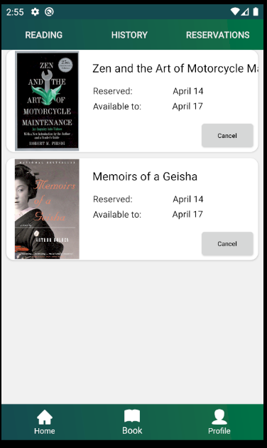

# BookHubApp

BookHubApp is a mobile application moving us from a stationary library to a mobile world. The project was created with college friends for course credit.

 ## Function

###Login and registration:

###A person who is not logged in can browse through the available library resources

###Person who is logged in addition has the possibility to

####Borrow books

####Show profile

####Reading / History / Reservation

####Cancellation of book reservation

####Edit user details

####Books reservations

####Extension of rental period

## Technical

   It has the necessary functionality to borrow and reserve a book. It uses the public API found at the [link](https://puz-biblioteka.herokuapp.com/). We used the MVC (Model-View-Controller) architectural model.
